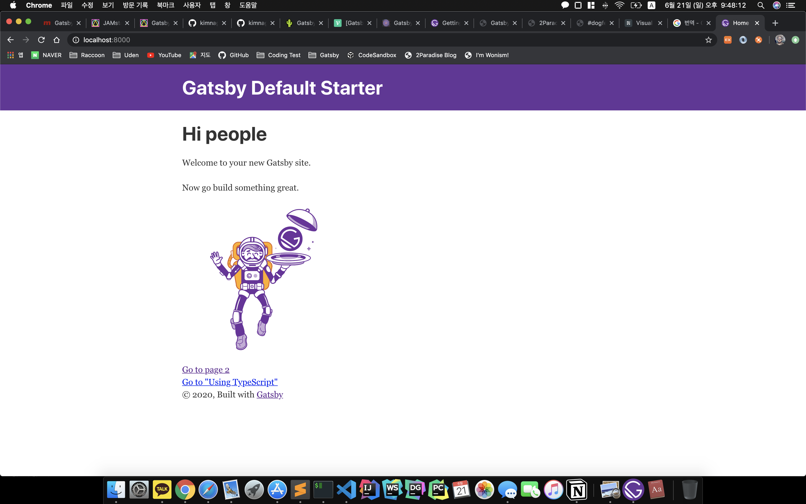
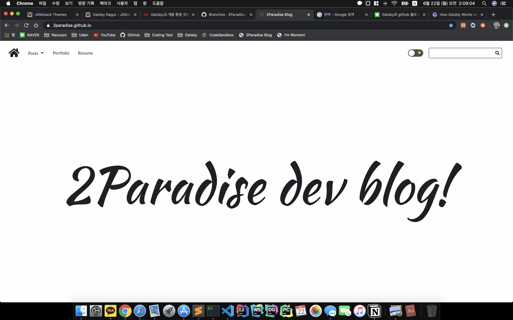

윈도우 환경에서만 개발을 해왔던 초보 mac 유저에게는 모든게 낯설고 힘들다. 

`React` 를 접하며 공부 목적의 Github Blog를 개설하기 위해 겪은 시행착오를 기준으로 주의할 점과 함께 포스팅 하려 한다. 

기본적으로 GatsbyJs 는 React 기반의 정적 페이지 생성 프레임 워크로, 가공할 정보를 `GraphQL` 에서 가져와 Bulid 시점에 정적 페이지를 만들어 내는 방식이다. 

# 기본 Gatsby Site 생성

[Quick Start](https://www.gatsbyjs.org/docs/quick-start/)

Gatsby Tutorial 사이트를 참고하여 기본적인 Gatsby Site 생성하는 방법부터 알아보자.

사용 방법은 `npm` `yarn` 모두 사용 가능하지만 본 Post 에서는 `npm` 을 사용하였다. 

### Gatsby CLI 설치

```bash
$ npm install -g gatsby-cli
```

### Site 생성

```bash
$ gatsby new gatsby-site
```

- 현 위치에서 gatsby-site 라는 폴더를 생성 후 gatsby site를 생성한다.

### 서버 시작

```bash
$ cd gatsby-site
$ gatsby develop
```

구동 후 [localhost:8000](http://localhost:8000) 에서 확인 할 수 있다.



기본 Gatsby Site 생성 및 로컬 서버 구동은 큰 이슈 없이 정상 작동 되는 것을 확인 할 수 있다. 문제는 Gatby Themes를 적용하려 할 때 발생 한다. 

# Gatsby Themes 적용하기

여러가지 Gatsby Themes을 제공해 주는 곳은 구글링을 통해 쉽게 접할 수 있다.

[JAMstack Themes](https://jamstackthemes.dev/#ssg=gatsby)

일반적으로 Gatsby Themes 를 적용한 블로그 생성을 위한 문서들이나, 포스팅 된 글들을 확인해보면 다음과 같은 순서로 가이드를 해주고 있다. 

```bash
$ gatsby new blog git@github.com:wonism/gatsby-advanced-blog.git
 
$ cd blog 
$ npm install
$ gatsby develop
```

 가지각색의 사람들이 만들고 배포하는 Gatsby themes github repositoy에서는 적용하려는 Gatsby Themes 에 맞는 node 버전을 사용해야 한다. 때문에 적용하려는 Themes 와 node 버전이 맞지 않는다면 Gatsby Site 생성 시, 또는 npm install 시 무언가 잘못되고 있다는 것을 알 수 있다. `nvm` 을 이용하여 Gatsby Themes 에 맞는 node로 버전을 변경해 주고 아래와 같이 다시 시도 해보자.

### Node Version Manage

[NVM으로 노드 버전 관리하기](http://jeonghwan-kim.github.io/2016/08/10/nvm.html)

일반적으로 Gatsby Themes Git에 들어가 보아도 node 버전을 명시해 준 곳이 많지 않기 때문에 참고하자. 

```bash
// 변경된 node 버전에 Gatsby-CLI가 깔려있지 않을 경우 다시 설치 해주어야 한다.
$ npm install -g gatsby-cli
$ git clone git@github.com:wonism/gatsby-advanced-blog.git blog

$ cd blog
$ npm install
$ npm upgrade
$ npm run deploy
```

정상 작동하는 것을 확인 한 뒤엔 clone 해온 `.git` 정보를 삭제하고 개인 Git 저장소를 remote 하자.

```bash
$ rm -rf .git
$ git init
$ git add .
$ git commit -m 'blog init'

$ git remote add origin https://github.com/YourID/YourGitRepoName.git
$ git push -u origin master
```

# gh-pages 를 이용하여 Github 배포 자동화

```bash
npm install gh-pages --save-dev
```

setting 된 Gatsby 프로젝트에서 `package.json` 파일을 열어 아래와 같이 수정한다.

`package.json`

```bash
{
  "scripts": {
    "deploy": "gatsby build --prefix-paths && gh-pages -d public -b master"
  }
}
```

Github Pages 는 개인 사이트와 프로젝트 사이트 2가지 종류가 있다. 개인사이트의 경우 Git repository 경로그대로 이지만 프로젝트 사이트의 경우 Git repository url /reponame 형식으로 구성되어 있기 때문에 `gatsby-config.js` 파일에 아래와 같이 pathPrefix를 설정해 주어야 한다.

```bash
module.exports = {
  pathPrefix: "/reponame",
}
```

모든 설정이 끝났으면 

```bash
$ npm run deploy
```



gh-pages 에 의해 자동으로 master branch에 빌드된 파일들이 올라간 것을 확인 할 수 있다. 빌드된 파일들이 master branch에 push 되기 때문에 소스파일 저장할 새로운 branch를 추가하여 소스 관리 하는 것이 좋아 보인다. 

```bash
$ git checkout -b develop
```

### Reference

[GatsbyJS](https://www.gatsbyjs.org/)
