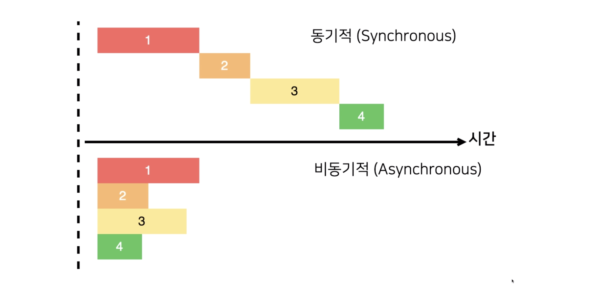

## Promise

비동기 작업을 보다 편리하게 처리하도록 ES6에 도입 되었다. lib 형태로 있던 기능이 JavaScript로 이전된 경우이다.

```javascript
const myPromise = new Promise((resolve, reject) => {
  setTimeout(() => {
    resolve("result");
  }, 1000);
});

myPromise
  .then(result => {
    console.log(result);
  })
  .catch(e => {
    console.error(e);
  });
```

```javascript
function increaseAndPrint(n) {
  return new Promise((resolve, reject) => {
    setTimeout(() => {
      const value = n + 1;
      if (value === 5) {
        const error = new Error();
        error.name = "ValueIsFiveError";
        reject(error);
        return;
      }

      console.log(value);
      resolve(value);
    }, 1000);
  });
}

increaseAndPrint(0)
  .then(increaseAndPrint)
  .then(increaseAndPrint)
  .then(increaseAndPrint)
  .then(increaseAndPrint)
  .then(increaseAndPrint)
  .catch(e => {
    console.error(e);
  });
```

## Async, Await

```javascript
function sleep(ms) {
  return new Promise(resolve => setTimeout(resolve, ms));
}

async function process() {
  console.log("안녕하세요.");
  await sleep(1000);
  console.log("반갑습니다.");
}

process();
```

콜백으로 비동기 처리 코드를 작성하지 않고 이러한 사고 방식를 벗어나 기본 코드 작성 방식으로 코드를 작성할 수 있도록 도와준다. 일반적으로 `await` 의 대상이 되는 비동기 처리 코드는 Axios 등 프로미스를 반환하는 API 호출 함수이다. 

`await`를 사용하지 않았다면 데이터를 받아온 시점에 콘솔을 출력 할 수 있게 콜백 함수나, `.then()`등을 사용해야 한다. 하지만 `async` `await` 문법 사용으로 비동기 처리 코드에 대한 사고를 하지 않아도 되는 것이다.

## Promise.all

```javascript
function sleep(ms) {
  return new Promise(resolve => setTimeout(resolve, ms));
}

const getDog = async () => {
  await sleep(1000);
  return "멍멍이";
};

const getCat = async () => {
  await sleep(3000);
  return "야옹이";
};

const getRabbit = async () => {
  await sleep(500);
  return "토끼";
};

async function process() {
  const dog = await getDog();
  console.log(dog);
  const cat = await getCat();
  console.log(cat);
  const rabbit = await getRabbit();
  console.log(rabbit);
}

process();
```

위와 같이 각 함수는 1, 3, 0.5초의 시간이 지난 뒤 결과 값을 return 해주는 async await 문법이 적용된 코드를 Promise.all 을 사용한다면 아래와 같이 코드를 작성 한다.

```javascript
async function process() {
	try{
		const [dog, rabbit, cat] = await Promise.all([
	    getDog(),
	    getRabbit(),
	    getCat()
	  ]);
	
	  console.log(dog);
	  console.log(cat);
	  console.log(rabbit);

	} catch (e) {
		console.log(e);
  }

}

```

`Promise.all` 함수의 배열 파라미터로 등록된 모든 함수들은 동시에 시작되며 결과 값은 배열로 return 된다. 때문에 배열 비구조화 할당 변수로 받아 확인 할 수 있다. 위의 코드가 작동 하는 시간은 3개의 함수 중 가장 오래 걸리는 3초 getCat() 함수가 끝나는 시간에 맞추어 결과 값이 return 된다. 또한 `Promise.all` 함수는 인자로 받은 함수 배열 중 하나라도 오류가 난다면 에러가 발생하기 때문에 `try{}catch{}` 구조로 작성해야 한다.

## Promise.race

Promise.race는 위와 같은 구조일 경우 3개의 파라미터 함수 중 코드 수행이 가장 빨리 끝난 값 1개만을 반환 한다. try{}catch{} 의 경우 가장 빨리 코드 수행이 끝난 함수의 error 만 잡아 낼 수 있다. 

```javascript
async function process() {
  try {
    const result = await Promise.race([
      getDog(),
      getRabbit(),
      getCat()
    ]);

    console.log(result);
  } catch (e) {
    console.log(e);
  }
}

------------------------CONSOLE

토끼
```
