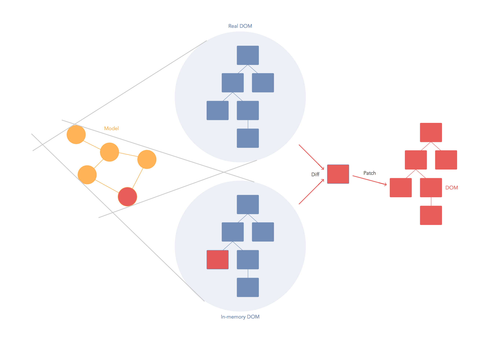

# React

본 Post 내용은 react 강의 정리 내용입니다. 출처 : [https://velopert.com/](https://velopert.com/)

 `React` 는 정말 인기있는 프론트엔드 라이브러리이다. 

 

 요즘의 웹은 단순 웹페이지가 아닌 웹 app의 형태를 띄고 있는 경우가 많기 때문에 귀찮은 돔, 상태값 업데이트 관리를 최소한으로 하고 오직 기능 개발, 사용자 인터페이스를 구현하는데 집중할 수 있도록 수많은 라이브러리들, 프레임워크들이 만들어졌다.

그 중 3대장을 꼽자면 `Angular`  `Vue`  `React` 를 꼽을 수 있다. 때문에 각각 기초 수준이라 하더라도 한번 쯤 사용해 보는 것을 권장하며, 각 도구들의 철학과 추구하는 방향이 다르다는 것을 아는 것이 중요하다. 

## Virtual DOM

> We built React to solve one problem: building large applications with data that changes over time.

기존 framwork들의 model은 대부분 양방향 바인딩을 통해 모델의 값이 변화면 view에서도 변하는 구조였다. 변화(Mutation), 즉 변화에 따른 로직을 정해야 하는데 React를 만들기 전에 이런 발상을 하였다. 

- React and the Virtual DOM ([https://www.youtube.com/watch?v=muc2ZF0QIO4](https://www.youtube.com/watch?v=muc2ZF0QIO4))

Virtual DOM은 가상의 DOM으로 변화(Mutation)가 일어나면 실제로 브라우저의 DOM에 새로운것을 넣는것이 아니라, JS로 이뤄진 가상 DOM에 한번 렌더링을 하고, 기존의 DOM과 비교를 한 다음에 정말 변화가 필요한 곳에만 UPDATE를 해주는 것이다. 

Virtual DOM은 DOM 변화를 최소화 시켜주는 역할을 하며, 이 횟수를 최소화 시키는 것은 성능 적으로 중요한 이슈이다. 

## React 써드파티 라이브러리

### React 라우터

- React-router
- Next.js
- After.js

### React 상태관리

- Redux
- MobX
- fr(e)actal

## React 를 시작하기 앞서 필요한 도구

### WebPack

code 의존 순서에 따라 합쳐 주는 도구, 빌드(번들링) 시 특정 확장자 마다 처리 준비를 해주는 도구라고 생각할 수 있다. 

### Babel

js 변환도구로 새로운 문법이 생성되는 요즘 같은 시대에 구버전 브라우저에서 모든 문법을 지원하지 않기 때문에 이전 js에도 적용될 수 있도록 도와주는 도구이다.
