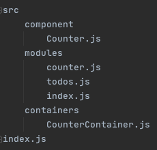

리액트 생태계에서 가장 사용률이 높은 상태관리 라이브러리이다. 관련 로직을 다른 파일로 분리하여 관리하여 글로벌 상태관리도 손쉽게 할 수 있다. context api를 사용하여도 무관하며 그 흐름도 유사하다. 

context api 가 불편했던 시절 redux를 사용하 것이 당연시 여겨졌었다. redux는 react 에서 사용되기 위해 사용된 라이브러리 지만 다른 프레임 워크에서 사용되기도 한다. 많이 사용된다고 해서 redux가 무조건 필요한 것은 아니다. 하지만 프로젝트 생산성에 큰 도움을 줄 수 있다는 것은 확실 하다. 

## context 와 redux

### 1. redux에는 미들웨어가 존재한다.

미들웨어로 할 수 있는 것들.

- 특정 조건에 따라 액션이 무시되게 만들 수 있다.
- 액션을 콘솔에 출력하거나, 서버쪽에 로깅을 할수 있다.
- 액션이 디스패치 됐을 때 이를 수정하여 리듀서에게 전달 되도록 할 수 있다.
- 특정 액션이 발생했을 때 이에 기반하여 다른 액션이 발생되도록 할 수 있다.
- 특정 액션이 발생했을 때 특정 자바스크립트 함수를 실행 시킬 수 있다.

주로 비동기 작업을 더욱 체계적으로 관리할 수 있다.

### 2. 유용한 함수와 Hooks를 지원받을 수 있다.

redux에서는 여러기능들이 존재한다.

- connect
- useSelector
- useDispatch
- useStore

### 3. 기본적인 최적화가 이미 되어있다.

### 4. 하나의 커다란 상태

context는 기능별로 만들어서 사용하는 것이 일반적이지만 redux는 글로벌 상태를 하나의 커다란 객체에 넣어 사용하는 것이 필수 이기 때문에 매번 context를 만드는 수고를 덜어 줄 수 있다.

### 5. DevTool

유용한 개발 도구가 많이 존재한다. 현재 상태를 한눈에 볼 수 있으며, 지금까지 어떤 변화가 있었는지, 특정시점으로 상태를 돌릴 수도 있다.

### 6. 이미 사용 중인 프로젝트가 많다.


## Redux에서 지켜야할 3가지 규칙

### 1. 하나의 애플리케이션엔 하나의 스토어가 있다.

 여러개의 store를 만드는 것이 가능하긴 하지만 권장하지 않는다. 만약 특정 업데이트가 빈번하게 일어나거나 애플리케이션의 특정 부분을 완전히 분리시키게 될 때 여러개의 store를 만들긴 하지만 일반적인 방법은 아니다. 여러개가 됬을 때 개발자 도구를 제대로 활용 할 수도 없게 된다.

### 2. 상태는 읽기전용 이다.

 불변성을 지키는 것은 많이 접해보았다. 객체가 있다면 spread 연산자를 통해 덮어씌워야 하며, 배열일 경우 `push`, `splice`, `reverse` 같은 함수가 아닌 `concat` `filter` `map` `slice` 같은 불변성을 지키는 함수를 사용해야 한다. 

 리덕스에서 상태의 불변성을 유지하는 것은 좋은 성능을 지키기 위함이며 컴포넌트들이 제대로 리랜더링 되게 하기 위해서 이다. 

### 3. 변화를 일으키는 함수 리듀서는 순수한 함수여야 한다.

 리듀서 함수는 이전 상태와, 액션 객체를 파라미터로 받는다. 

이전의 상태는 절대로 변경하지 않고, 변화를 일으킨 새로운 상태 객체를 만들어서 반환한다. 

**똑같은 파라미터**로 호출된 리듀서 함수는 **언제나 똑같은 결과값**을 반환해야 한다.

```javascript
new Date()
math.random()
axios.get()
```

똑같은 파라미터로 호출했지만 위와 같은 결과가 달라지는 함수는 사용해서는 안된다.


# Redux 사용준비

프로젝트를 생성하고 redux 설치

```javascript
$ yarn add redux
```

기본적이 redux 사용 예시

exercise.js

```javascript
import {createStore} from "redux";

const initialState ={
    counter : 0,
    text : '',
    list : []
};

const INCREASE = 'INCREASE';
const DECREASE = 'DECREASE';
const CHANGE_TEXT = 'CHANGE_TEXT';
const ADD_TO_LIST = 'ADD_TO_LIST';

const increase = () => ({type: INCREASE});

const decrease = () => ({type: DECREASE});

const changeText = text => ({type: CHANGE_TEXT, text});

const addToList = item => ({type: ADD_TO_LIST, item});

function reducer(state = initialState, action){
    switch (action.type) {
        case INCREASE:
            return {
                ...state,
                counter: state.counter + 1
            };
        case DECREASE:
            return {
                ...state,
                counter: state.counter -1
            };
        case CHANGE_TEXT:
            return {
                ...state,
                text: action.text
            };
        case ADD_TO_LIST:
            return {
                ...state,
                list: state.list.concat(action.item)
            };
        default:
            return state;
    }
}

const store = createStore(reducer);

const listener = () => {
    const state = store.getState();
    console.log(state);
}

const unsubscribe = store.subscribe(listener);

store.dispatch(increase());
store.dispatch(decrease());
store.dispatch(changeText("안녕하세요."));
store.dispatch(addToList({id:1, text:'와우'}));
```

## 리덕스 모듈 만들기

리덕스 모듈이랑 `액션타입` `액션생성함수` `리듀서` 가 들어있는 파일을 말한다. Ducks 패턴이라고 부른다. 

리덕스를 처음 배우는 과정에서 사용하면 상당히 쉽게 접근 할 수 있다. 



modules/counter.js

```javascript

const SET_DIFF = 'counter/SET_DIFF';
const INCREASE = 'counter/INCREASE';
const DECREASE = 'counter/DECREASE';

export const setDiff = diff => ({type: SET_DIFF, diff});
export const increase = () => ({type: INCREASE});
export const decrease = () => ({type: DECREASE});

const initialState = {
    number : 0,
    diff: 1
};

export default function counter(state = initialState, action) {
    switch (action.type) {
        case SET_DIFF:
            return {
                ...state,
                diff: action.diff
            };
        case INCREASE:
            return {
                ...state,
                number: state.number + state.diff
            };
        case DECREASE:
            return {
                ...state,
                number: state.number - state.diff
            };
        default:
            return state;
    }
}
```

modules/todos.js

```javascript
const SET_DIFF = 'counter/SET_DIFF';
const INCREASE = 'counter/INCREASE';
const DECREASE = 'counter/DECREASE';

export const setDiff = diff => ({type: SET_DIFF, diff});
export const increase = () => ({type: INCREASE});
export const decrease = () => ({type: DECREASE});

const initialState = {
    number : 0,
    diff: 1
};

export default function counter(state = initialState, action) {
    switch (action.type) {
        case SET_DIFF:
            return {
                ...state,
                diff: action.diff
            };
        case INCREASE:
            return {
                ...state,
                number: state.number + state.diff
            };
        case DECREASE:
            return {
                ...state,
                number: state.number - state.diff
            };
        default:
            return state;
    }
}
```

modules/index.js

```javascript
import {combineReducers} from "redux";
import counter from "./counter";
import todos from "./todos";

const rootReducer = combineReducers({
    counter,
    todos
});

export default rootReducer;
```

index.js

```javascript
import React from 'react';
import ReactDOM from 'react-dom';

import {Provider} from "react-redux";
import {createStore} from "redux";
import rootReducer from "./modules";

const store = createStore(rootReducer);

ReactDOM.render(
  <Provider store={store}>
    <App />
  </Provider>,
  document.getElementById('root')
);
```

component/Counter.js

```javascript
import React from 'react';

function Counter({number, diff, onIncrease, onDecrease, onSetDiff}) {
    
    const onChange = e => {
        onSetDiff(parseInt(e.target.value, 10));
    };

    return (
        <div>
            <h1>{number}</h1>
            <div>
                <input type="number" value={diff} onChange={onChange}/>
                <button onClick={onIncrease}>+</button>
                <button onClick={onDecrease}>-</button>
            </div>
        </div>
    );
}

export default Counter;
```

containers/CounterContainer.js

```javascript
import React from 'react';
import Counter from "../components/Counter";
import {useSelector, useDispatch} from "react-redux";
import {decrease, increase, setDiff} from "../modules/counter";

function CounterContainer() {
    const {number, diff} = useSelector(state => ({
        number: state.counter.number,
        diff: state.counter.diff
    }));

    const dispatch = useDispatch();

    const onIncrease = () => dispatch(increase());
    const onDecrease = () => dispatch(decrease());
    const onSetDiff = diff => dispatch(setDiff(diff));

    return (
        <Counter number={number} diff={diff} onIncrease={onIncrease} onDecrease={onDecrease} onSetDiff={onSetDiff}/>
    );
}

export default CounterContainer;
```
