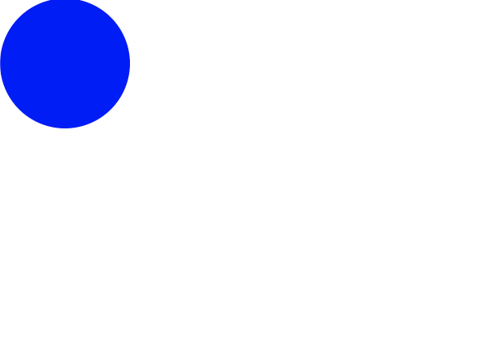

# Sass (Syntactically Awesome StyleSheet)

 CSS pre-processor 로서, 복잡한 작업을 쉽게 할 수 있게 해주고, 코드의 재활용성을 높여줄 뿐 만 아니라, 코드의 가독성을 높여 주어 유지보수를 쉽게 해준다.

Sass 에서는 두 가지의 확장자 (.scss/.sass) 를 지원한다. Sass 가 처음 나왔을떈 sass 만 지원되었고, sass 는 문법이 아주 다르다. 현재는 scss가 더 많이 쓰인다. 

### Sass install

```bash
$ yarn add node-sass
```


# Style Component

 현재 가장 인기있는 CSS in JS 라이브러리이다. `emotion`, `styled-jsx`, `jss` 등의 다른 라이브러리 들도 존재 하며 emotion 도 많이 사용 되고 있다. 

styled-component 를 사용하면 다음과 같다. 

```javascript
import React from 'react';
import styled from 'styled-components';

const Circle = styled.div`
	width : 5rem;
	height : 5rem;
	background : black;
	border-radius : 50%;
`;

function App(){
	return <Circle/>;
}

export default App;
```

위와 같이 `styled-component`를 사용하여 css가 적용된 컴포넌트를 바로 만들어 사용할 수 있게 해준다. 

Tagged Template Literal 이라는 문법이다. 

```javascript
function sample(texts, ...fns){
	const mockProps = {
		title : '안녕하세요',
		body : '내용은 내용내용 입니다.'
	}
	return texts.reduce((result, text, i) => `${result}${text}${fns[i] ? fns[i](mockProps) : ''}`, '');
}

sample`
	제목 : ${props => props.title}
	내용 : ${props => props.body}
`;

/*
"
	제목 : 안녕하세요
	내용 : 내용은 내용내용 입니다.
"
*/
```

이제 `styled-component` 를 설치해 보자.

```bash
$ yarn add styled-components
```

```javascript
import React from 'react';
import styled, {css} from 'styled-components';

const Circle = styled.div`
  width : 5rem;
  height: 5rem;
  background: ${props => props.color};
  border-radius: 50%;
  
  ${props => 
			props.huge &&
			css`
					width:10rem;height:10rem;
			`
		}
`;

function App() {
  return <Circle color="blue" huge />;
}

export default App;
```



## Styled-components 로 재사용 높은 버튼 만들기

(+ Polished lib)

```bash
$ yarn add polished
```

Button.js

```javascript
import React from 'react';
import styled, {css} from 'styled-components';
import {darken, lighten} from 'polished';

const StyledButton = styled.button`
    /* 공통 스타일 */
    display:inline-flex;
    outline:none;
    border: none;
    border-radius: 4px;
    color: white;
    font-weight: bold;
    cursor: pointer;
    padding-left: 1rem;
    padding-right: 1rem;
    
    /* 크기 */
    height: 2.25rem;
    font-size: 1rem;
    
    /* 색상 */
    ${props => {
        const color = props.theme.palette[props.color];
        return css`
            background: ${color};
            &:hover {
                background: ${props => lighten(0.1, color)};
            }
            &:active {
                background: ${props => darken(0.1, color)};
            }
        `;
    }}   
    
    /* 기타 */
    & + & {
        margin-left: 1rem;
    }
`;

function Button({children, color, ...rest}) {
    return <StyledButton color={color} {...rest}>{children}</StyledButton>;
}

Button.defaultProps = {
    color : 'blue'
}
export default Button;
```

App.js

```javascript
import React from 'react';
import styled, {ThemeProvider} from 'styled-components';
import Button from "./components/Button";

const AppBlock = styled.div`
  width: 512px;
  margin: 0 auto;
  margin-top: 4rem;
  border: 1px solid black;
  padding: 1rem;
`;

const palette = {
    blue: '#228be6',
    gray: '#496057',
    pink: '#f06595'
};

function App() {
  return (
      <ThemeProvider theme={{palette}}>
        <AppBlock>
          <Button>Button</Button>
          <Button color="gray">Button</Button>
          <Button color="pink">Button</Button>
        </AppBlock>
      </ThemeProvider>
  );
}

export default App;
```

위와 같이 styled-components를 이용하여 코딩을 할 수 있다. 

color 관련 소스는 다음과 같이 표현도 가능하다. 

```javascript
    ${props => {
        const color = props.theme.palette[props.color];
        return css`
            background: ${color};
            &:hover {
                background: ${props => lighten(0.1, color)};
            }
            &:active {
                background: ${props => darken(0.1, color)};
            }
        `;
    }}
```

props 를 비구조화 할당 하여 간략하게 작성 간단하며, 아래 영역을 밖으로 빼내어 사용할 수 도 있다. 

```javascript
    ${{theme, color} => {
        const selected = theme.palette[color];
        return css`
            background: ${selected};
            &:hover {
                background: ${props => lighten(0.1, selected)};
            }
            &:active {
                background: ${props => darken(0.1, selected)};
            }
        `;
    }}
```

```javascript
const colorStyles = css`
    ${{theme, color} => {
        const selected = theme.palette[color];
        return css`
            background: ${selected};
            &:hover {
                background: ${props => lighten(0.1, selected)};
            }
            &:active {
                background: ${props => darken(0.1, selected)};
            }
        `;
    }}
`;

const StyledButton = styled.button`
	${colorStyles}
`;
```
