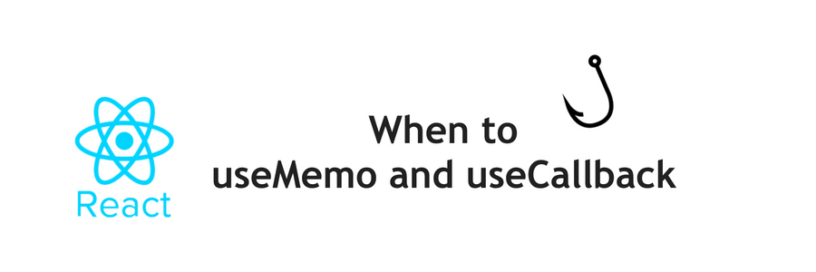

React를 사용함에 있어서 기본적으로 최적화 이슈와 함께 고민해야 할 부분인 메모제이션 훅 useCallback, useMemo 에 대한 이해의 필요성을 느끼게 되어 여러 문서들을 참고해 정리해 보고자 한다. 

 

useCallback과 useMemo의 차이를 간략히 정리하자면 다음과 같이 설명할 수 있다.

  

- useMemo : **함수의 return 값**을 기억
- useCallback: **함수 reference** 를 기억

 

## useMemo

---

`useMemo` hook은 복잡한 로직에 의해 계산량이 많거나 고비용의 DB 네트워크 호출이 필요한 **함수의 반환 값을 재활용하는 용도**로 사용된다. 

 

```javascript
const memoizedValue = useMemo(() => computeExpensiveValue(a, b), [a, b]);
```

 

첫번째 매개변수로 함수를 전달하며 `useMemo` hook은 이 함수의 return value를 기억한다. 두번째 매개변수는 의존성 배열로 이 값이 변경되지 않으면 이전 return value를 재사용하는 방식이다. 

## useCallback

---

`useCallback hook`은 함수의 reference를 반환한다. 즉 메모제이션된 콜백을 반환하는 것이다. 때문에 엄밀히 살펴 보자면 `useCallback(fn, deps)` 는 `useMemo(() ⇒ fn, deps)` 와 같다고 할 수 있다.

```javascript
const memoizedCallback = useCallback(() => {doSomething(a, b);}, [a, b]);
```

브라우저에서 함수 생성 자체가 성능에 미치는 영향은 작다고 하지만 prop으로 전달되는 함수의 경우 매번 그 참조값이 바뀌기 때문에 자식 컴포넌트에서 `React.Memo`를 사용해도 불필요한 렌더링이 발생될 수 밖에 없다. 이러한 문제를 해결하기 위해 `useCallback`이 필요하다. 

## 그렇다면 언제 useMemo, useCallback를 사용해야 할까?

---

1. 레퍼런스 (메모리 값) 이 동일한지 비교 - (Referential equality)
2. 컴퓨터를 활용하는 비싼 연산 (Computationally expensive calculations)

### Referential equality

```javascript
true === true // true
false === false // true
1 === 1 // true
'a' === 'a' // true
{} === {} // false
[] === [] // false
() => {} === () => {} // false
const z = {}
z === z // true
// NOTE: React actually uses Object.is, but it's very similar to ===
```

React에서 리랜더링을 위해 prop 이 갱신되었는지를 비교할 때, 그리고 의존성 배열이 필요한 react hooks 에서도  레퍼런스 비교를 위해 [Object.is](http://object.ishttps://developer.mozilla.org/ko/docs/Web/JavaScript/Reference/Global_Objects/Object/is#Description) 를 활용한 비교를 적용한다. 이 비교 방법에 따라 리랜더링 되는 조건에 대한 이해가 된다면 `useCallback` 의 사용 이유 가 명확해 진다.

```javascript
function DualCounter() {
  const [count1, setCount1] = React.useState(0)
  const increment1 = () => setCount1(c => c + 1)

  const [count2, setCount2] = React.useState(0)
  const increment2 = () => setCount2(c => c + 1)

  return (
    <>
      <CountButton count={count1} onClick={increment1} />
      <CountButton count={count2} onClick={increment2} />
    </>
  )
}
```

여기서 두 버튼 중 어떤 것을 누르더라도 두 개의 `CountButton` 은 다시 랜더링된다.

1. 상태 업데이트
2. `DualCounter` 내부의 변수 재생성 (`increment1`, `increment2`)
3. 각각의 `CountButton` 은 다른 버튼의 상태와 전혀 상관 없이 내려받는 함수들이 새로 생성되었기 때문에 다시 랜더링

이 “불필요한 리랜더링” 문제를 해결하려면 `CountButton` 과 `DualCounter` 두 컴포넌트 모두 최적화해야 한다.

```javascript
const CountButton = React.memo(function CountButton({ onClick, count }) {
  return <button onClick={onClick}>{count}</button>
})

function DualCounter() {
  const [count1, setCount1] = React.useState(0)
  const increment1 = React.useCallback(() => setCount1(c => c + 1), [])

  const [count2, setCount2] = React.useState(0)
  const increment2 = React.useCallback(() => setCount2(c => c + 1), [])

  return (
    <>
      <CountButton count={count1} onClick={increment1} />
      <CountButton count={count2} onClick={increment2} />
    </>
  )
}
```

---

 실행되는 모든 코드는 각각 한 줄마다 비용이 발생한다. 실제로 퍼포먼스 개선이 없는 부분에서 `useCallback` 호출, 의존성 배열( `[]` )을 선언함으로 리소스를 더 잡아먹게 될 수가 있다는 것이다. 또한 함수 자체를 메모제이션을 하기 위해 추가로 메모리를 선점하게 된다. 

###it's best to measure first.

 모든 최적화에는 비용이 발생한다. 때문에 정확한 퍼포먼스 측정이 선행된 최적화를 통해 성급한 최적화를 피해야 한다. 

의존성 배열이 필요한 hook 사용 시, 함수 안에서 참조되는 모든 값은 의존성 배열에 포함되어 있어야 하기 때문에 의존성이 바르게 정의 될 수 있도록 돕는 패치지 설치를 권장한다. 
- [eslint-plugin-react-hooks](https://www.npmjs.com/package/eslint-plugin-react-hooks#installation) 패키지의 일부인 [exhaustive-deps](https://github.com/facebook/react/issues/14920) 규칙 사용 권장

### 참조

- [When to useMemo and useCallback - (Kent C. Dodds post)](https://kentcdodds.com/blog/usememo-and-usecallback)
- [How to use React useMemo and useCallback hook - (Linguine Code post)](https://linguinecode.com/post/react-usememo-usecallback-hook)
- [Hooks API Reference](https://ko.reactjs.org/docs/hooks-reference.html#usememo)
- 실전 리액트 프로그래밍 (이재승 지음)
